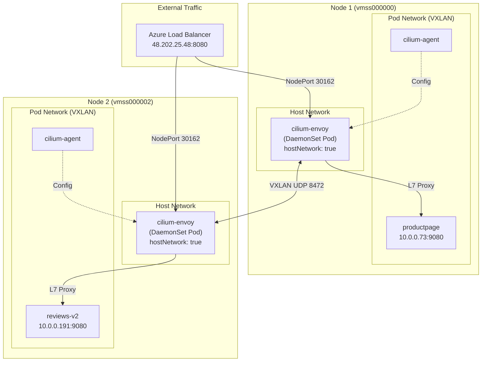
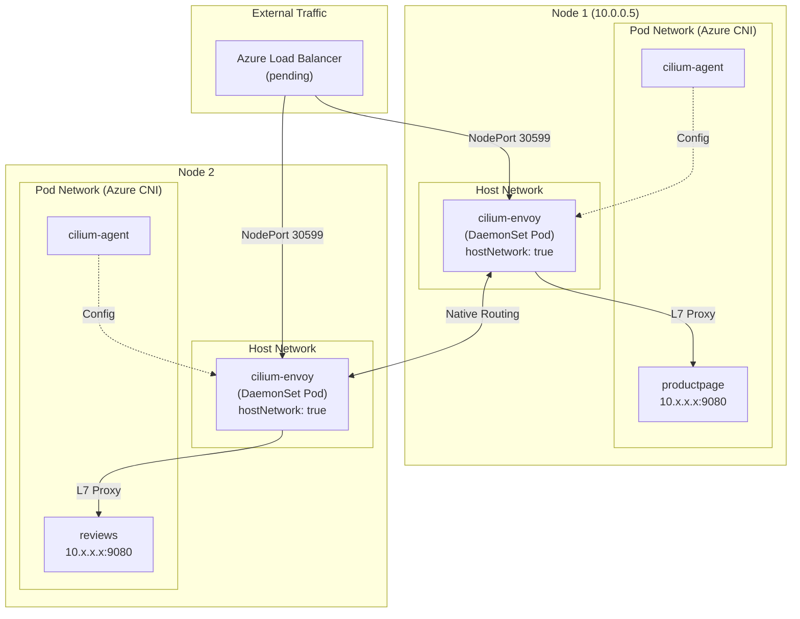
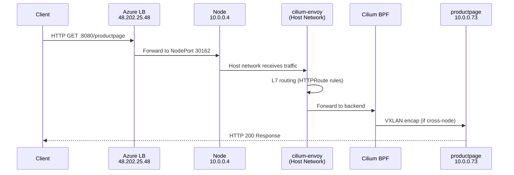
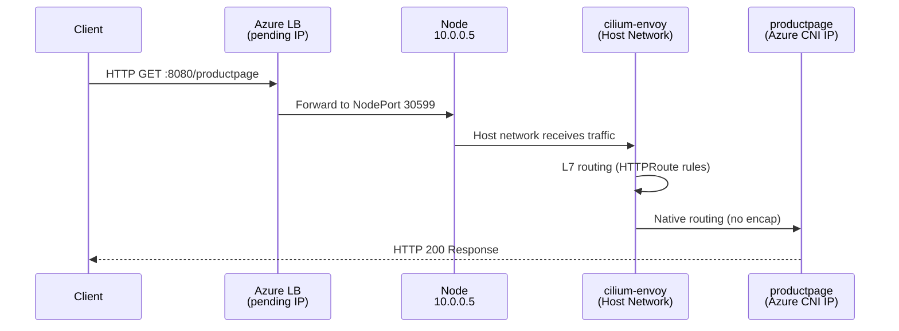
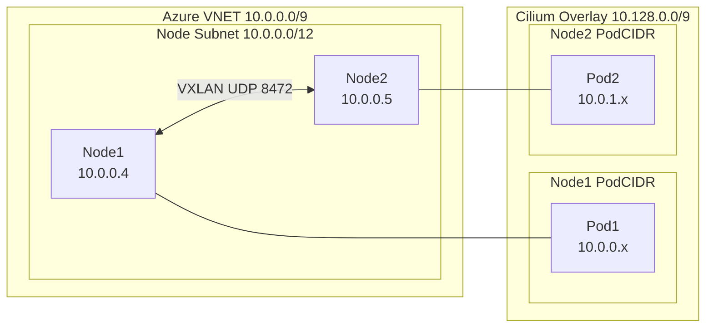
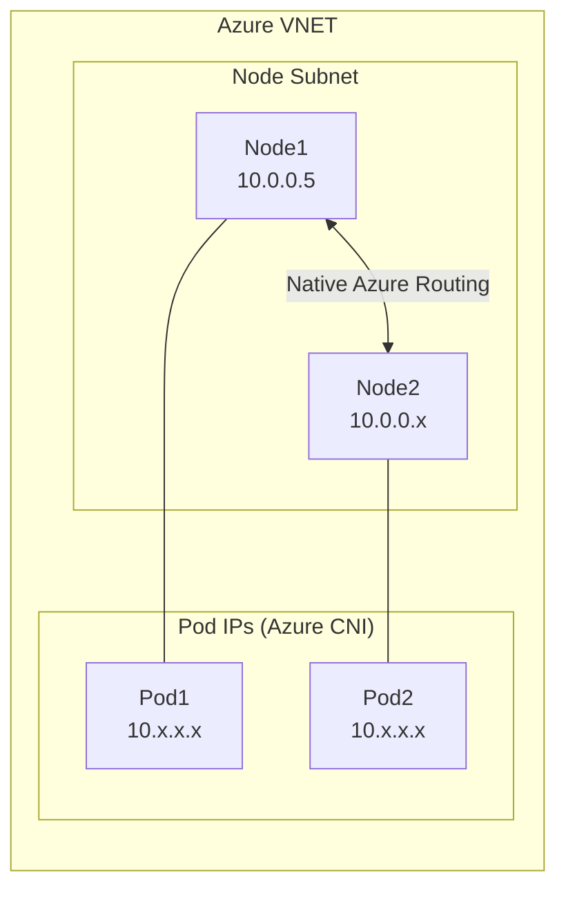

# Cilium Gateway API Cluster Comparison

This document compares two Cilium deployments with different configurations for Gateway API.

## ⚠️ Critical: Official Cilium Limitation

**In official Cilium v1.18.2 (and main branch), Gateway API is NOT compatible with `delegated-plugin` IPAM.**

The validation in [pkg/option/config.go](pkg/option/config.go) explicitly blocks this:

```go
// envoy config (Ingress, Gateway API, ...) require cilium-agent to create an IP address
// specifically for differentiating envoy traffic, which is not possible
// with delegated IPAM.
if c.EnableEnvoyConfig {
    return fmt.Errorf("--%s must be disabled with --%s=%s", EnableEnvoyConfig, IPAM, ipamOption.IPAMDelegatedPlugin)
}
```

**Cluster 2 uses custom patches** that add an exception for:
- `gateway-api-hostnetwork-enabled: true` — Gateway listeners bind to host network, uses node IP as ingress IP

> **Note:** The `external-envoy-proxy-pod-network` option exists in Cilium for running Envoy in pod network (not hostNetwork), but that's a different deployment model and out of scope for this work.

These patches are NOT in upstream Cilium yet.

### ✅ Custom Patches Now Working (3 Fixes Applied)

The custom patches have been completed and tested successfully:

| Fix | File | Change |
|-----|------|--------|
| 1. Ingress IP | `daemon/cmd/ipam.go` | Use node internal IP as ingress IP when `GatewayAPIHostnetworkEnabled=true` |
| 2. Ingress Endpoint | `daemon/cmd/daemon_main.go` | Create ingress endpoint whenever ingress IP exists (removed hostNetwork skip) |
| 3. LoadBalancer Service | `operator/pkg/model/translation/gateway-api/translator.go` | Allow LoadBalancer service type with `externalTrafficPolicy: Local` for hostNetwork |

**Working Images:**
- Agent: `acnpublic.azurecr.io/matmerr/cilium-dev:v1.18.2-cef6429bff-hostnet-ingressip2`
- Operator: `acnpublic.azurecr.io/matmerr/operator-generic:v1.18.2-cef6429bff-hostnet-lb`

---

## Clusters

| Cluster | Name | Description |
|---------|------|-------------|
| **Cluster 1** | `matmerr-nonaz-cilium-4` | External Envoy + VXLAN tunnel + Cilium IPAM |
| **Cluster 2** | `matmerr-byo-cilium-3` | External Envoy + Native routing + Delegated IPAM (Azure CNI) — **requires custom patches** |

---

## Cluster Overview

| Feature | **Cluster 1**<br/>`matmerr-nonaz-cilium-4` | **Cluster 2**<br/>`matmerr-byo-cilium-3` |
|---------|---------------------------|-------------------------|
| **Gateway Host Network** | `false` | `true` (required for delegated IPAM) |
| **IPAM** | `cluster-pool` | `delegated-plugin` |
| **Routing Mode** | `tunnel` (VXLAN) | `native` |
| **Masquerading** | IPTables (Enabled) | Disabled |
| **LB IPAM** | `true` | `false` |
| **External Envoy Proxy** | `true` (DaemonSet) | `true` (DaemonSet) ✅ |
| **Gateway External IP** | `48.202.25.48` ✅ | `48.202.48.157` ✅ |
| **Gateway Service Type** | LoadBalancer | LoadBalancer ✅ (was ClusterIP before fix) |
| **Azure Subscription** | `Azure Network Agent - Build Validations` | `Azure Network Agent - Test` (9b8218f9) |
| **Custom Patches Required** | No | **Yes** (agent + operator) |
| **Operator Version** | v1.18.6 | Custom `v1.18.2-cef6429bff-hostnet-lb` |

---

## Envoy Deployment Architectures

Both clusters now use external Envoy proxy (DaemonSet). The key difference is the networking mode.

> **Note:** Cluster 2 was originally configured with embedded Envoy (`external-envoy-proxy: false`), but we successfully changed it to external Envoy to demonstrate that **external Envoy works with delegated IPAM**.

### Cluster 1: `matmerr-nonaz-cilium-4` — External Envoy Proxy (DaemonSet)



**Key Characteristics:**
- `external-envoy-proxy: true`
- Envoy runs as a **separate DaemonSet** (`cilium-envoy`)
- Each node has its own Envoy pod on **host network**
- Cilium agent configures Envoy via Unix socket/API
- Gateway Service is type `LoadBalancer` with Cilium LB IPAM
- Cross-node traffic uses **VXLAN tunneling** (requires NSG rules for UDP 8472)

### Cluster 2: `matmerr-byo-cilium-3` — External Envoy + Native Routing + Delegated IPAM



**Key Characteristics:**
- `external-envoy-proxy: true` ✅ (changed from `false`)
- Envoy runs as a **separate DaemonSet** (`cilium-envoy`) — 3 pods running
- `gateway-api-hostnetwork-enabled: true` - Gateway pods use host network
- Uses **delegated IPAM** (Azure CNI assigns pod IPs)
- **Native routing** - no encapsulation overhead
- No Cilium LB IPAM - relies on Azure cloud provider for LoadBalancer IPs

---

## Gateway API Traffic Flow

### Cluster 1: `matmerr-nonaz-cilium-4` — Default Mode (Pod Network Gateway)



### Cluster 2: `matmerr-byo-cilium-3` — External Envoy + Native Routing



---

## Configuration Comparison

### Cilium ConfigMap Differences

| Setting | Cluster 1<br/>`matmerr-nonaz-cilium-4` | Cluster 2<br/>`matmerr-byo-cilium-3` |
|---------|---------------------------|-------------------------|
| `ipam` | `cluster-pool` | `delegated-plugin` |
| `routing-mode` | `tunnel` | `native` |
| `tunnel-protocol` | `vxlan` | N/A |
| `enable-ipv4-masquerade` | `true` | `false` |
| `external-envoy-proxy` | `true` | `true` ✅ |
| `gateway-api-hostnetwork-enabled` | `false` | `true` |
| `enable-lb-ipam` | `true` | `false` |

### Envoy Deployment

| Aspect | Cluster 1 | Cluster 2 |
|--------|-----------|-----------|
| **Deployment Type** | DaemonSet (`cilium-envoy`) | DaemonSet (`cilium-envoy`) ✅ |
| **Pod Count** | 2 (one per node) | 3 (one per node) |
| **Network Mode** | `hostNetwork: true` | `hostNetwork: true` |
| **Resource Isolation** | Separate from Cilium agent | Separate from Cilium agent |
| **Upgrade Independence** | Can upgrade Envoy separately | Can upgrade Envoy separately |

---

## Network Architecture

### Cluster 1: `matmerr-nonaz-cilium-4` — VXLAN Overlay



**Requirements:**
- NSG rule allowing UDP 8472 between nodes
- NSG rule allowing TCP 4240 for health checks

### Cluster 2: `matmerr-byo-cilium-3` — Native Routing (Azure CNI)



**Advantages:**
- No encapsulation overhead
- Azure handles routing natively
- No special NSG rules for tunnel traffic
- Pod IPs are routable within VNET

---

## When to Use Each Configuration

### Use Cluster 1 Config (`matmerr-nonaz-cilium-4` style) — External Envoy + VXLAN:
- ✅ You want Cilium to manage all networking (full CNI replacement)
- ✅ You need Cilium LB IPAM for Gateway external IPs
- ✅ You want to upgrade Envoy independently of Cilium
- ✅ Network policy isolation is a priority
- ⚠️ Requires NSG rules for VXLAN (UDP 8472)

### Use Cluster 2 Config (`matmerr-byo-cilium-3` style) — External Envoy + Native:
- ✅ You're using Azure CNI with delegated IPAM
- ✅ You want native Azure routing (no overlay)
- ✅ Lower latency is critical (no encapsulation)
- ✅ Simpler NSG configuration (no tunnel ports)
- ✅ Can upgrade Envoy separately from Cilium
- ⚠️ Gateway external IP must come from Azure (cloud provider LB)

---

## Current Issues

### Cluster 1: `matmerr-nonaz-cilium-4`
- ✅ Gateway working with external IP `48.202.25.48`
- ⚠️ Required manual NSG rules for VXLAN (UDP 8472) and health (TCP 4240)

### Cluster 2: `matmerr-byo-cilium-3`
- ✅ External Envoy DaemonSet running (3/3 pods)
- ✅ Gateway external IP: `48.202.48.157` (LoadBalancer service)
- ✅ HTTP 200 responses working via external IP
- ✅ CiliumNode has ingress IPs: `10.0.0.4`, `10.0.0.5`, `10.0.0.6` (node IPs)
- ✅ Ingress endpoint created with identity 8 (reserved:ingress)

### Azure LB Conflict (Resolved)

Cluster 2 had a pre-existing Azure LB rule named `test` on port 8080 that conflicted with the Gateway service:

```
Error: RulesUseSameBackendPortProtocolAndPool
Message: Load balancing rules .../test and .../a6076014de3f147dd8b6f3a55acc964a-TCP-8080 
         with floating IP disabled use the same protocol Tcp and backend port 8080
```

**Resolution:** Deleted the conflicting `test` rule from the Azure LB:
```bash
az network lb rule delete \
  --resource-group mc_matmerr-byo-cilium-3_matmerr-byo-cilium-3_westus2 \
  --lb-name kubernetes --name test
```

---

## Root Cause Analysis: Gateway Connectivity on Cluster 2

### Envoy Error Logs

```
cilium.bpf_metadata (north/south L7 LB): No local Ingress IP source address configured for the family of 20.236.10.163
cilium.network: Cilium policy filter state not found
cilium.l7policy: Cilium policy filter state not found
```

### Ingress IP Comparison

| Aspect | Cluster 1 | Cluster 2 |
|--------|-----------|-----------|
| CiliumNode `spec.addresses.ingress` | `ipv4: 10.0.0.8` ✅ | `ipv4: 10.0.0.4` (node IP) ✅ |
| `cilium-dbg status` Proxy IP | `10.0.0.186` (from pod CIDR) | Node IP (from node) |
| Ingress IP Allocated | ✅ Yes | ✅ Yes (node IP used) |
| Ingress Endpoint Created | ✅ Yes | ✅ Yes |

### How Ingress IP Works in Normal hostNetwork Mode (Cluster 1)

**Question:** Why does cluster 1 with `gateway-api-hostnetwork-enabled: false` still work with external Envoy in hostNetwork?

**Answer:** In **official Cilium v1.18.2**, ingress IP allocation is unconditional:

```go
// Official v1.18.2: daemon/cmd/ipam.go
func (d *Daemon) allocateIngressIPs() error {
    bootstrapStats.ingressIPAM.Start()
    if option.Config.EnableEnvoyConfig {  // <-- Simple condition
        // Always allocate ingress IP when envoy config is enabled
        result, err = d.ipam.AllocateNextFamilyWithoutSyncUpstream(ipam.IPv4, "ingress", ipam.PoolDefault())
        node.SetIngressIPv4(result.IP)
    }
}
```

This means cluster 1 gets an ingress IP (`10.0.0.8`) even though Envoy runs on host network. The ingress IP is used by:

1. **BPF metadata filter** - Identifies external traffic destined for L7 proxy
2. **Policy enforcement** - Creates a "fake endpoint" for ingress traffic policy
3. **SNAT for proxy traffic** - Envoy uses this IP as source when forwarding to backends

### Problem Explanation

The **original custom patches** skipped ingress IP allocation when `gateway-api-hostnetwork-enabled: true`:

```go
// ORIGINAL patch (BROKEN): daemon/cmd/ipam.go
// Skip ingress IP allocation when:
// 1. Gateway API uses host network mode (traffic flows through host network), OR
// 2. External Envoy proxy runs in pod network (uses its own pod IP from delegated IPAM)
if option.Config.EnableEnvoyConfig && !option.Config.GatewayAPIHostnetworkEnabled && !option.Config.ExternalEnvoyProxyPodNetwork {
    // Only allocate ingress IP when hostnetwork is disabled
}
```

This was incorrect because the Envoy BPF metadata filter (`cilium/bpf_metadata.cc`) still expects an ingress IP to identify and process external traffic.

### ✅ Fix Applied: Use Node IP as Ingress IP

The fix uses the node's internal IP as the ingress IP when hostNetwork mode is enabled:

```go
// FIXED: daemon/cmd/ipam.go
func (d *Daemon) allocateIngressIPs() error {
    bootstrapStats.ingressIPAM.Start()
    
    // For host network mode with delegated IPAM, use node IP as ingress IP
    // This allows BPF metadata filter to identify external traffic without
    // needing to allocate an IP from the delegated IPAM pool.
    if option.Config.GatewayAPIHostnetworkEnabled {
        if option.Config.EnableIPv4 {
            nodeIP := node.GetInternalIPv4()
            if nodeIP != nil {
                node.SetIngressIPv4(nodeIP)
                d.logger.Info(fmt.Sprintf("  Ingress IPv4 (using node IP for host network mode): %s", nodeIP))
            }
        }
        // Similar for IPv6...
        return nil
    }
    // ... normal IPAM allocation for non-hostNetwork mode
}
```

This allows the BPF metadata filter to work correctly while avoiding IPAM allocation from the delegated plugin.

### Why the Patch Made This Assumption (Incorrectly)

With delegated IPAM, Cilium cannot allocate IPs - the external CNI (Azure CNI) owns IP allocation. The patch tried to work around this by:

1. Skipping ingress IP allocation (can't allocate from delegated IPAM)
2. Using hostNetwork mode so Envoy doesn't need a pod IP
3. Binding directly to host port 8080

But this breaks the BPF→Envoy integration which still needs the ingress IP for traffic identification.

### Why Cluster 1 Works

| Step | Cluster 1 | Cluster 2 (after fix) |
|------|-----------|-----------|
| 1. Ingress IP | `10.0.0.8` allocated from cluster-pool | Node IP (e.g., `10.0.0.4`) ✅ |
| 2. Ingress Endpoint | Created with ingress IP | Created with node IP ✅ |
| 3. BPF Metadata | Uses ingress IP to identify traffic | Uses node IP ✅ |
| 4. Policy State | Found via ingress endpoint | Found via ingress endpoint ✅ |

**Key Insight:** Both clusters now have ingress IPs - cluster 1 allocates from IPAM, cluster 2 uses the node's internal IP.

### ✅ Complete Patches (All Three Fixes)

The custom patches have been completed and tested:

**What's patched:**
- ✅ Skip validation error for delegated IPAM + envoy config
- ✅ **Use node IP as ingress IP** when `GatewayAPIHostnetworkEnabled=true`
- ✅ **Create ingress endpoint** whenever ingress IP exists (removed hostNetwork check)
- ✅ Operator generates CiliumEnvoyConfig with `0.0.0.0:8080` listener
- ✅ **Allow LoadBalancer service type** with `externalTrafficPolicy: Local` for hostNetwork

**Files modified:**
1. `daemon/cmd/ipam.go` - Use node IP for ingress in hostNetwork mode
2. `daemon/cmd/daemon_main.go` - Create ingress endpoint regardless of hostNetwork
3. `operator/pkg/model/translation/gateway-api/translator.go` - Allow LoadBalancer + hostNetwork

### Resolution: Custom Agent + Operator Images

**Issue:** Original patches were incomplete - skipped ingress IP and endpoint creation entirely.

**Solution:** Three fixes applied:

| Fix | Component | Change |
|-----|-----------|--------|
| 1 | Agent | Use node IP as ingress IP for hostNetwork mode |
| 2 | Agent | Create ingress endpoint whenever ingress IP exists |
| 3 | Operator | Allow LoadBalancer service with `externalTrafficPolicy: Local` |

**Images built:**
```bash
# Agent with ingress IP + endpoint fixes
acnpublic.azurecr.io/matmerr/cilium-dev:v1.18.2-cef6429bff-hostnet-ingressip2

# Operator with LoadBalancer fix
acnpublic.azurecr.io/matmerr/operator-generic:v1.18.2-cef6429bff-hostnet-lb
```

**Deployment:**
```bash
# Update agent
kubectl set image ds/cilium -n kube-system \
  cilium-agent=acnpublic.azurecr.io/matmerr/cilium-dev:v1.18.2-cef6429bff-hostnet-ingressip2

# Update operator  
kubectl set image deploy/cilium-operator -n kube-system \
  cilium-operator=acnpublic.azurecr.io/matmerr/operator-generic:v1.18.2-cef6429bff-hostnet-lb

# Delete Gateway service to trigger re-reconciliation
kubectl delete svc cilium-gateway-bookinfo-gateway -n default

# Verify
kubectl get gateway bookinfo-gateway  # Should show PROGRAMMED=True, ADDRESS=<external-ip>
kubectl get svc cilium-gateway-bookinfo-gateway  # Should show TYPE=LoadBalancer
```

### Gateway Behavior with `gateway-api-hostnetwork-enabled: true`

With host network mode enabled AND our custom operator fix:

| Aspect | Without hostNetwork | With hostNetwork (after fix) |
|--------|---------------------|------------------|
| Service Type | LoadBalancer | **LoadBalancer** ✅ |
| External IP | Azure LB assigns IP | Azure LB assigns IP ✅ |
| `externalTrafficPolicy` | Cluster | **Local** (preserves client IP) |
| Listener Binding | L7 proxy port (127.0.0.1) | **0.0.0.0:8080** (host port) |
| Traffic Path | LB → NodePort → L7 → Backend | LB → NodePort → Host:8080 → Backend |

### Diagnostic Findings (Updated - All Working)

| Aspect | Cluster 1 | Cluster 2 (after fixes) |
|--------|-----------|-----------|
| `gateway-api-hostnetwork-enabled` | `false` | `true` |
| Gateway Service Type | LoadBalancer | LoadBalancer ✅ |
| Gateway External IP | `48.202.25.48` | `48.202.48.157` ✅ |
| Envoy Listener Address | L7 proxy | `0.0.0.0:8080` |
| Ingress IP | From IPAM | Node IP ✅ |
| Ingress Endpoint | Created | Created ✅ |
| Gateway Works | ✅ Yes | ✅ Yes |

---

## Key Findings

### 1. External Envoy is Orthogonal to IPAM Mode

You can use any combination of external Envoy and IPAM:

| external-envoy-proxy | IPAM | Works? |
|---------------------|------|--------|
| `true` | `cluster-pool` | ✅ |
| `true` | `delegated-plugin` | ✅ With custom patches |
| `false` | `cluster-pool` | ✅ |
| `false` | `delegated-plugin` | ✅ With custom patches |

This is because `cilium-envoy` DaemonSet uses `hostNetwork: true`, so it doesn't need a pod IP from either IPAM mode. The Cilium agent needs an ingress IP for BPF metadata filtering - with our fix, it uses the node's internal IP.

### 2. Ingress IP is Required Even with Host Network Envoy

The ingress IP serves multiple purposes in Cilium's L7 proxy architecture:

| Purpose | Description | Works without Ingress IP? |
|---------|-------------|---------------------------|
| BPF Metadata | Identifies traffic destined for L7 proxy | ❌ No |
| Policy Enforcement | Creates endpoint for ingress policy rules | ❌ No |
| SNAT Source | Used as source IP when Envoy forwards to backends | ❌ No |
| Traffic Accounting | Distinguishes proxy traffic in metrics | ❌ No |

**Solution:** Use node IP as ingress IP when `gateway-api-hostnetwork-enabled: true`.

### 3. Official Cilium Blocks Delegated IPAM + Gateway API

In **official Cilium v1.18.2**, this combination is explicitly blocked:

```go
// pkg/option/config.go (official v1.18.2)
if c.EnableEnvoyConfig {
    return fmt.Errorf("--%s must be disabled with --%s=%s", EnableEnvoyConfig, IPAM, ipamOption.IPAMDelegatedPlugin)
}
```

**Our patch** adds an exception when `gateway-api-hostnetwork-enabled: true`.

### 4. ✅ Custom Patches Are Complete and Working

All three issues have been fixed:

| Issue | Symptom | Fix |
|-------|---------|-----|
| Missing ingress IP | BPF metadata filter error, HTTP 500 | Use node IP |
| Missing ingress endpoint | "Access denied" HTTP 403 | Create endpoint when IP exists |
| Forced ClusterIP | No external IP | Allow LoadBalancer with Local policy |

**Current State:**
- ✅ Agent starts without error
- ✅ Operator generates correct CiliumEnvoyConfig
- ✅ Envoy binds to `0.0.0.0:8080` on host network
- ✅ Envoy receives connections
- ✅ BPF metadata filter works (uses node IP)
- ✅ Gateway service is LoadBalancer with external IP
- ✅ Returns HTTP 200 to clients

